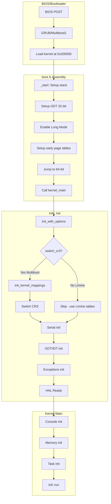
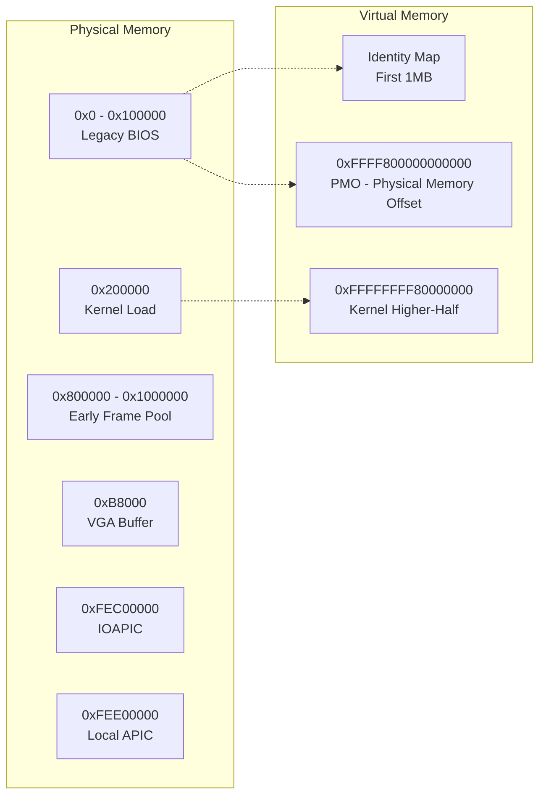
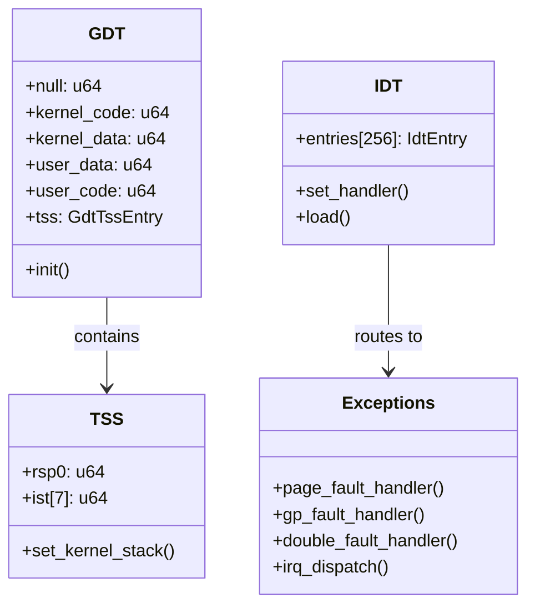
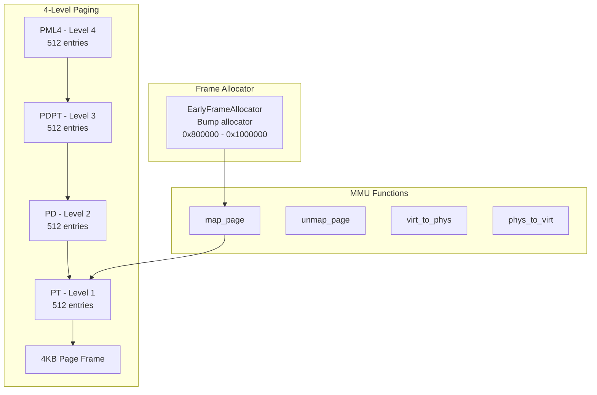
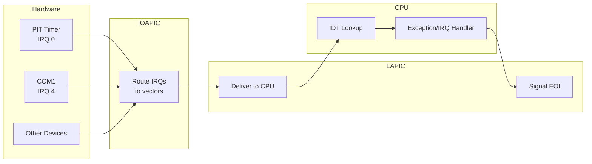
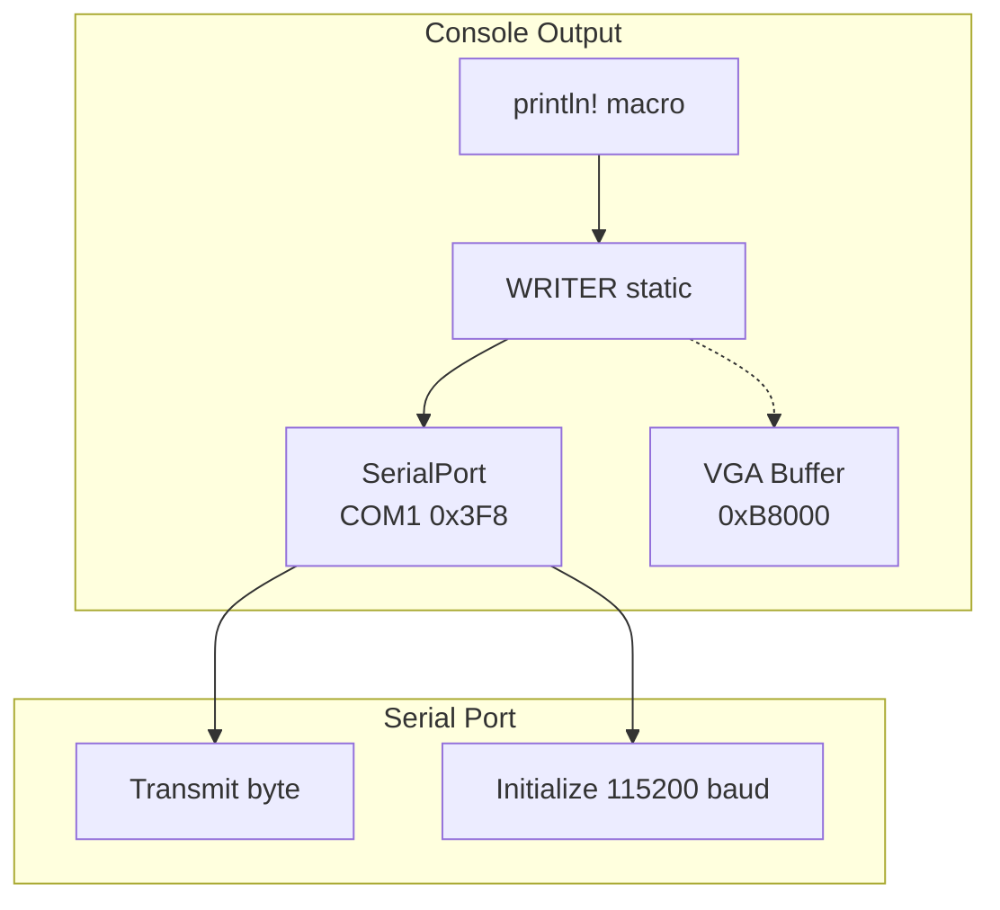

# x86_64 Hardware Abstraction Layer

This directory contains the x86_64-specific HAL implementation, organized into logical compartments.

## Directory Structure

```
x86_64/
├── cpu/           # CPU structures (GDT, TSS, IDT, exceptions)
├── mem/           # Memory management (paging, MMU, frame allocator)
├── interrupts/    # Interrupt handling (APIC, IOAPIC, PIT)
├── io/            # I/O devices (serial, VGA, console)
├── boot/          # Boot protocols (Multiboot2)
└── mod.rs         # Main module with init functions
```

## Boot Flow

The following diagram shows the x86_64 boot sequence from BIOS/bootloader to kernel:



## Memory Layout



## Compartment Details

### cpu/ - CPU Structures



### mem/ - Memory Management



### interrupts/ - Interrupt Handling



### io/ - I/O Devices



## Key Constants

| Constant | Value | Description |
|----------|-------|-------------|
| `KERNEL_VIRT_BASE` | `0xFFFFFFFF80000000` | Kernel higher-half base |
| `PHYS_OFFSET` | `0xFFFF800000000000` | Physical memory offset (PMO) |
| `PAGE_SIZE` | `0x1000` (4KB) | Standard page size |
| `HUGE_PAGE_SIZE` | `0x200000` (2MB) | Huge page size |
| `APIC_BASE` | `0xFEE00000` | Local APIC address |
| `IOAPIC_BASE` | `0xFEC00000` | I/O APIC address |

## Known Issues (TEAM_316)

1. **PMO Limited to 1GB** - The early page tables only map the first 1GB via PMO.
   APIC/IOAPIC addresses (~4GB) are outside this range, causing `phys_to_virt()` to
   return unmapped addresses.

2. **APIC Init Skipped** - Currently using legacy PIC mode because APIC access
   via `phys_to_virt()` crashes.

3. **Crash at 0x800200188** - Unresolved crash during TaskControlBlock creation.
   Needs binary-level analysis.

## Files

| File | Description |
|------|-------------|
| `cpu/gdt.rs` | Global Descriptor Table and TSS |
| `cpu/idt.rs` | Interrupt Descriptor Table |
| `cpu/exceptions.rs` | Exception handlers and IRQ dispatch |
| `mem/paging.rs` | Page table structures and operations |
| `mem/mmu.rs` | Memory mapping, address translation |
| `mem/frame_alloc.rs` | Early bump allocator for page frames |
| `interrupts/apic.rs` | Local APIC controller |
| `interrupts/ioapic.rs` | I/O APIC for external interrupts |
| `interrupts/pit.rs` | Programmable Interval Timer |
| `interrupts/state.rs` | Interrupt enable/disable/restore |
| `io/serial.rs` | COM1 serial port driver |
| `io/vga.rs` | VGA text mode buffer |
| `io/console.rs` | Console writer abstraction |
| `boot/multiboot2.rs` | Multiboot2 boot info parsing |
